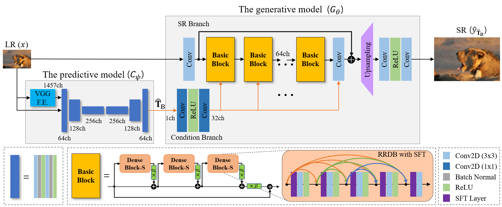
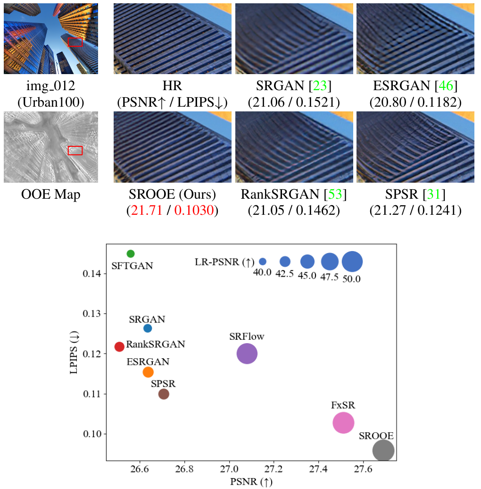
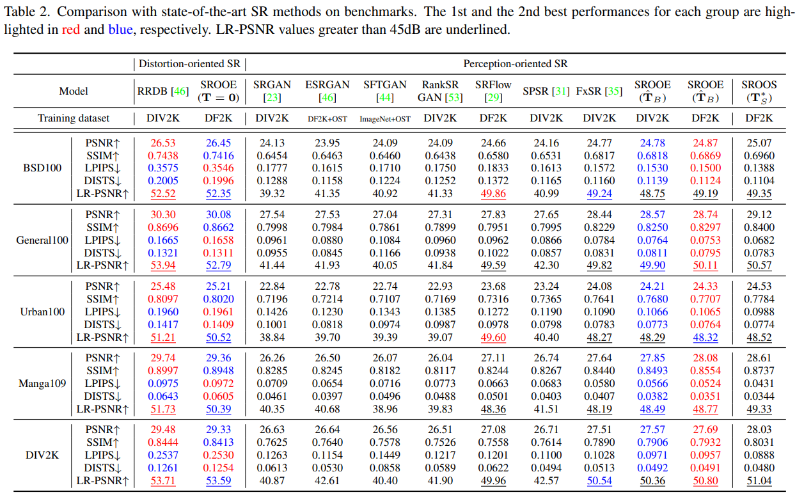
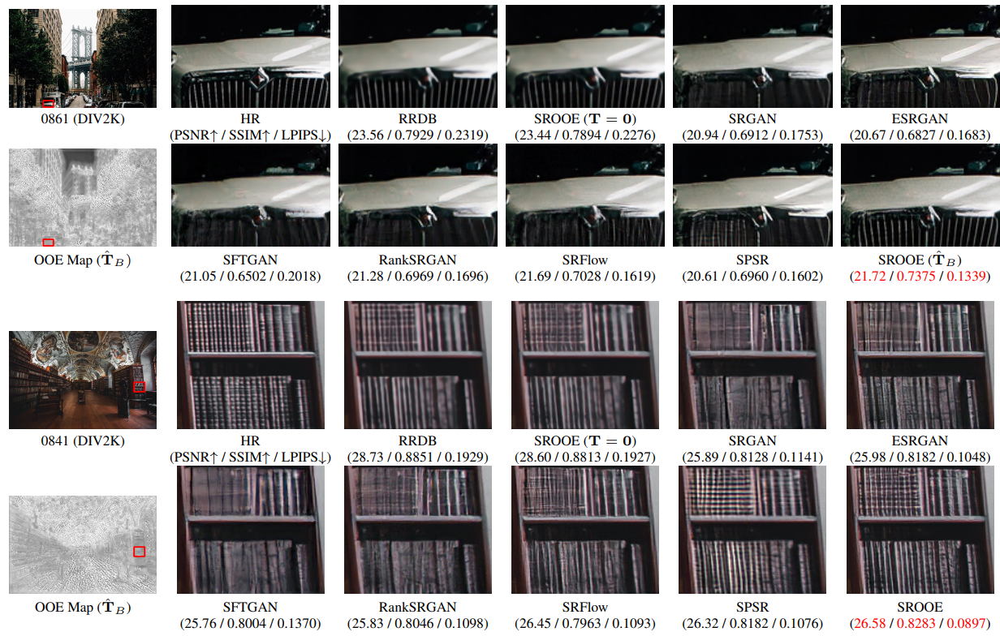
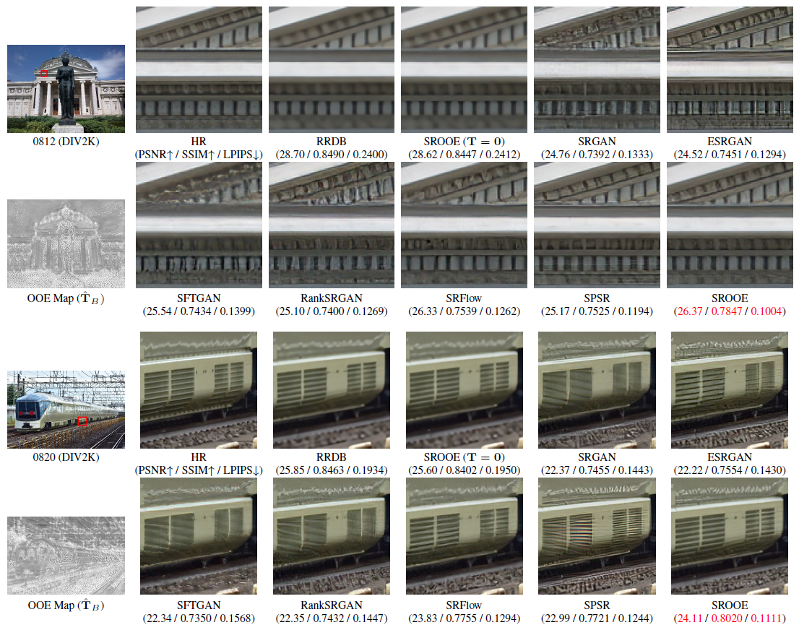
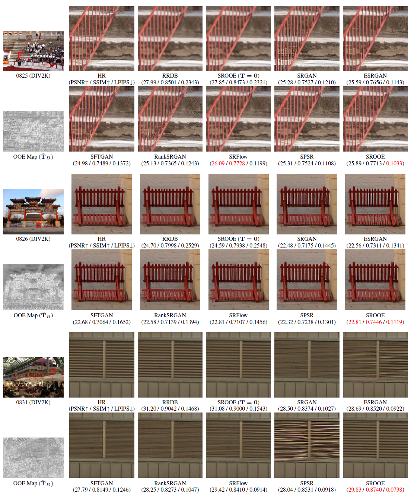
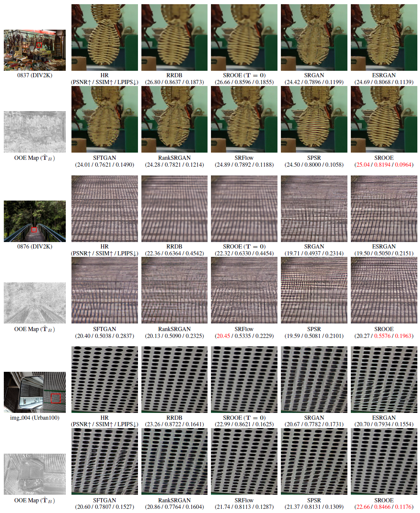
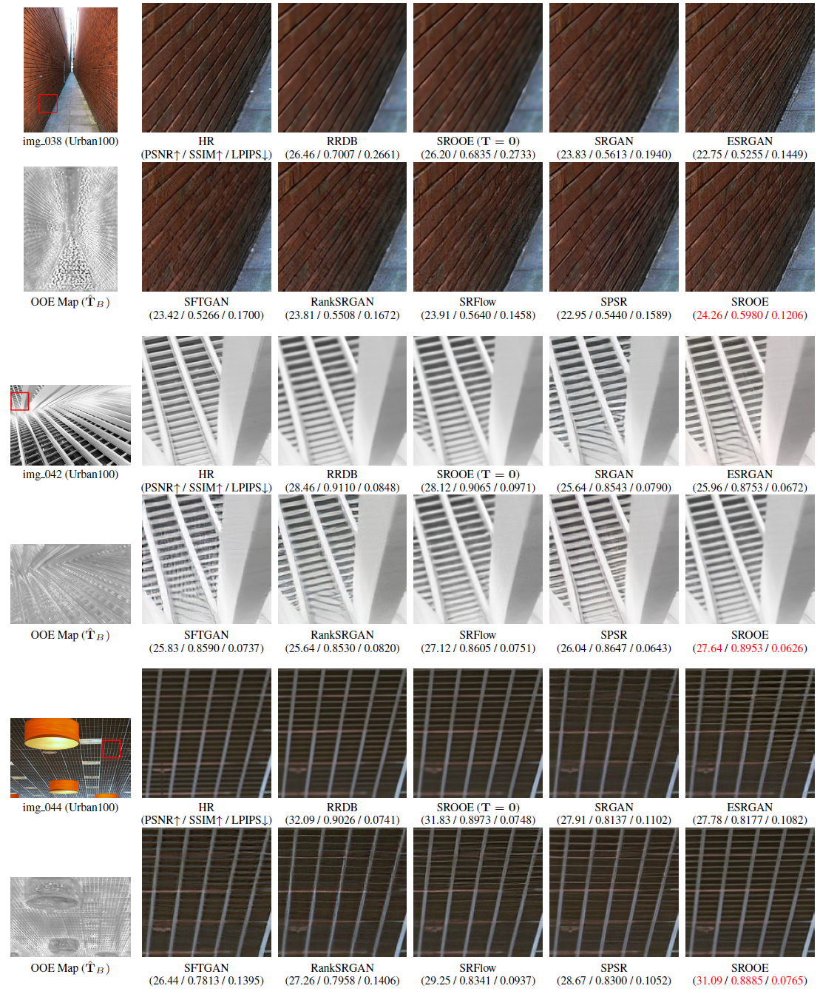
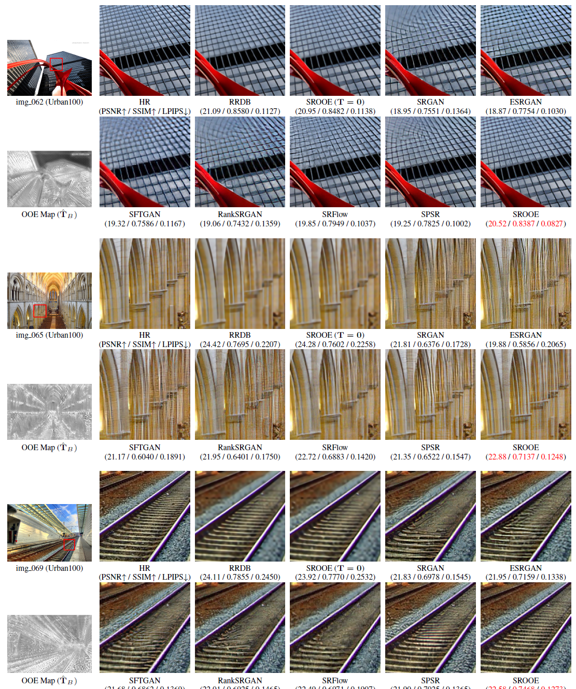
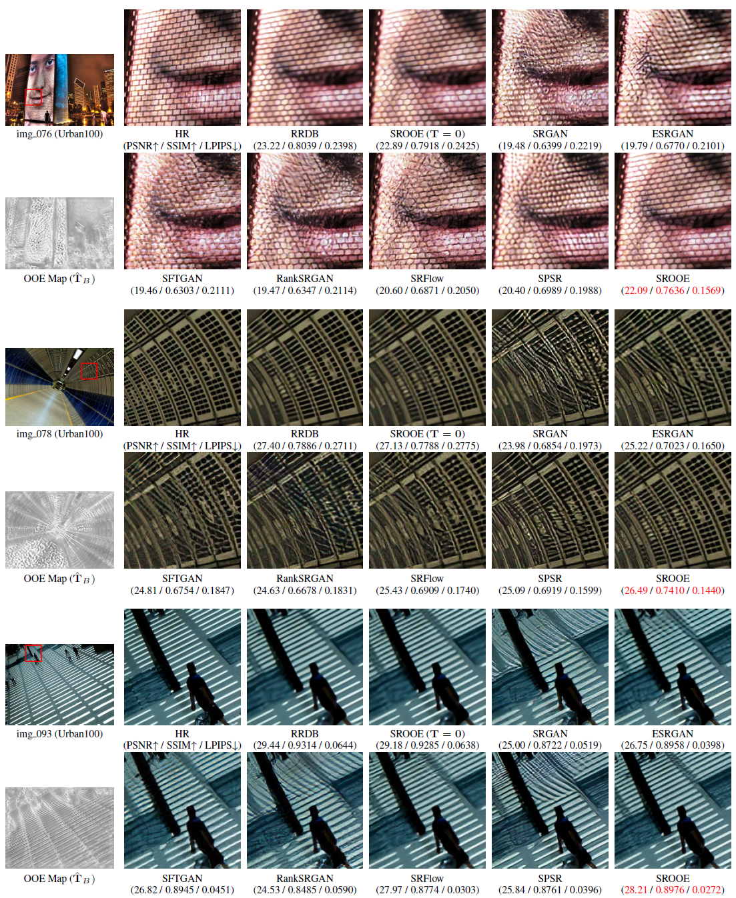

# SROOE

# Perception-Oriented Single Image Super-Resolution using Optimal Objective Estimation (CVPR 2023) <a href="https://openaccess.thecvf.com/content/CVPR2023/html/Park_Perception-Oriented_Single_Image_Super-Resolution_Using_Optimal_Objective_Estimation_CVPR_2023_paper.html">Link</a>

Seung Ho Park, Young Su Moon, Nam Ik Cho

## SROOE Architecture

## SROT (the generative SR model) Training <a href="https://github.com/seungho-snu/SROT">Link</a>

### Visual and quantitative comparison. 
The proposed SROOE shows a higher PSNR, LRPSNR and lower LPIPS than other state-of-the-art methods, i.e, lower distortion and higher perceptual quality.

## Usage:

### Environments
- Pytorch 1.10.0
- CUDA 11.3
- Python 3.8

### Test

To test the pretrained ESRGAN-SROT model:

    python test.py -opt options/test/test_SROOE_4x.yml
    
- Before running the test code, download the pretrained SR 4x model (SROT) <a href="https://www.dropbox.com/s/v7lx9qoji1ndonx/SR.pth?dl=0">Link</a> and the pretrained OOE model <a href="https://www.dropbox.com/s/hoykbrpadzozlab/OOE.pth?dl=0">Link</a>   

### Training
First, you need to train SROT model <a href="https://github.com/seungho-snu/SROT">Link</a>, or you use the pretrained SROT model <a href="https://www.dropbox.com/s/v7lx9qoji1ndonx/SR.pth?dl=0">Link</a>.

To train a SROOE model:

    python train.py -opt options/train/train.yml
    
Before running the trainig code, prepare the training pairs. The example of uising the DIV2K dataset is
(1) Generate SROT results with different t values. Set the test.yml file as followings:

datasets:
  test_100:
    name: DIV2K_train_HR
    mode: LQ
    dataroot_LQ: E:\exp\dataset\DIV2K_train_LRx4_mod4
    
Then,    

    python test.py -opt options/test/test.yml -t 0.00
    python test.py -opt options/test/test.yml -t 0.05
    python test.py -opt options/test/test.yml -t 0.10
    ...
    python test.py -opt options/test/test.yml -t 0.95
    python test.py -opt options/test/test.yml -t 1.00
    
After running command lines above, you will get the folder structure as followings

    ├── codes
    ├── LPIPS-Map-Gen
    ├── figures
    ├── pretrained
    └── retuls: Pre-trained models are included (Model Zoo)
        ├──> ESRGAN-SROT-M1234-v2-4x_t000
                └──> DIV2K_train_HR
        ├──> ESRGAN-SROT-M1234-v2-4x_t005
                └──> DIV2K_train_HR
        ├──> ...
        ├──> ESRGAN-SROT-M1234-v2-4x_t095
                └──> DIV2K_train_HR
        └──> ESRGAN-SROT-M1234-v2-4x_t100
                └──> DIV2K_train_HR

(2) Generate LPIPS maps for the SROT results with different t values

To generate LPIPS maps, use the following command line. lpips_measure.py is in the LPIPS-Map-Gen folder.

    python lpips_measure.py HR_image_folder_path SR_image_folder_path
    
for example
    
    python lpips_measure.py path_to_GT\DIV2K_train_HR path_to_SROOE\SROT-main\results\ESRGAN-SROT-M1234-v2-4x_t000\DIV2K_train_HR
    python lpips_measure.py path_to_GT\DIV2K_train_HR path_to_SROOE\SROT-main\results\ESRGAN-SROT-M1234-v2-4x_t005\DIV2K_train_HR
    ...
    python lpips_measure.py path_to_GT\DIV2K_train_HR path_to_SROOE\SROT-main\results\ESRGAN-SROT-M1234-v2-4x_t095\DIV2K_train_HR
    python lpips_measure.py path_to_GT\DIV2K_train_HR path_to_SROOE\SROT-main\results\ESRGAN-SROT-M1234-v2-4x_t100\DIV2K_train_HR
    
After running command lines above, you will get the folder structure as followings

    ├── codes
    ├── LPIPS-Map-Gen
    ├── figures
    ├── pretrained
    └── retuls: Pre-trained models are included (Model Zoo)
        ├──> ESRGAN-SROT-M1234-v2-4x_t000
                ├──> DIV2K_train_HR
                └──> DIV2K_train_HR_LPIPS
        ├──> ESRGAN-SROT-M1234-v2-4x_t005
                ├──> DIV2K_train_HR
                └──> DIV2K_train_HR_LPIPS
        ├──> ...
        ├──> ESRGAN-SROT-M1234-v2-4x_t095
                ├──> DIV2K_train_HR
                └──> DIV2K_train_HR_LPIPS
        └──> ESRGAN-SROT-M1234-v2-4x_t100
                ├──> DIV2K_train_HR    
                └──> DIV2K_train_HR_LPIPS
    
(3) Generate T_OOS_Maps for each images. To generate T_OOS_Maps, use the following command line. generate_T_OOS_Map.py is in the LPIPS-Map-Gen folder.

    python generate_T_OOS_Map.py ... to be continued...
   
    .....

## Experimental Results

### Quantitative Evaluation

### Visual Evaluation

Visual comparison with state-of-the-art perception-driven SR methods

# Citation

    @misc{https://doi.org/10.48550/arxiv.2211.13676,
      doi = {10.48550/ARXIV.2211.13676},
      url = {https://arxiv.org/abs/2211.13676},
      author = {Park, Seung Ho and Moon, Young Su and Cho, Nam Ik},
      title = {Perception-Oriented Single Image Super-Resolution using Optimal Objective Estimation},
      publisher = {arXiv},
      year = {2022},  
      copyright = {arXiv.org perpetual, non-exclusive license}
    }
    
    @InProceedings{Park_2023_CVPR,
        author    = {Park, Seung Ho and Moon, Young Su and Cho, Nam Ik},
        title     = {Perception-Oriented Single Image Super-Resolution Using Optimal Objective Estimation},
        booktitle = {Proceedings of the IEEE/CVF Conference on Computer Vision and Pattern Recognition (CVPR)},
        month     = {June},
        year      = {2023},
        pages     = {1725-1735}
    }

# Acknowledgement
Our work and implementations are inspired by and based on BasicSR <a href="https://github.com/xinntao/BasicSR">[site]</a> 
